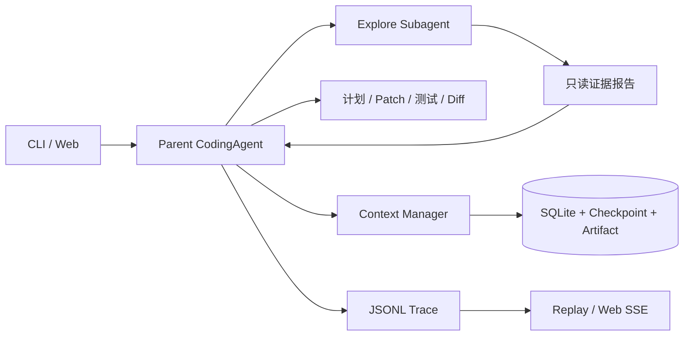

# MiniCode Agent

一个从零实现的本地 Coding Agent，目标是复现 Claude Code / Codex 的核心工作流，并把每次修改变成可追踪、可恢复、可验证的工程过程。

当前版本：`0.9.0`。M0–M5.2（含 M4.2 双模式路由）已完成实现，离线测试 `46/46 OK`；真实 DeepSeek 父子 Agent 验收仍需使用者执行。

```text
理解任务 → Explore Subagent 取证 → 父 Agent 复核 → 计划 → Patch
        → 测试 → 失败修复 → Diff → 完成协议 → Checkpoint/Replay
```

## 项目亮点

- 自主 Agent Loop：支持 DeepSeek OpenAI-compatible 流式响应和增量 tool call 组装；
- 可验证编码闭环：计划、unified diff Patch、受限命令、测试、Diff 与 `finish_task` 完成门禁；
- Explore Subagent：独立 Prompt、上下文、Provider、预算、Run 和 Trace，只能读取代码；
- 父子证据门禁：child 返回结构化 `path:line` 证据，父 Agent 必须重新读取后才能 Patch；
- 上下文工程：大结果 artifact 化、旧上下文压缩、SQLite/JSON checkpoint 和安全 resume；
- 可观测性：JSONL 事件、Replay、步骤/工具/测试/Token/耗时指标和故障注入；
- ChatGPT 式本地 Web：多轮会话、SSE 流式回答、工具/Subagent 卡片、计划/测试/Diff 抽屉；
- 意图路由与双模式：自动区分普通对话、只读仓库问答和编码任务，也可手动选择“对话/编码”；
- 安全策略：workspace 边界、敏感路径保护、无 Shell 命令白名单和 15 个版本化安全探针；
- 可复现评测：5 个只读任务、3 个 Coding 任务、20 个隐藏测试任务和 46 个离线测试。

## 架构



父 Agent 最多委派两个 Explore child。child 不具备写工具且不能递归委派；child 失败时，parent 可以使用自己的只读工具降级继续。

## 快速开始

### 1. 环境

- Python 3.11+
- Windows、macOS 或 Linux
- DeepSeek API Key；离线测试不需要 Key
- 可选：`rg`，缺失时自动使用 Python 搜索回退

项目仅使用 Python 标准库，无需安装运行时依赖：

```powershell
python -m venv .venv
Copy-Item .env.example .env
notepad .env
```

在 `.env` 填写：

```dotenv
DEEPSEEK_API_KEY=你的真实Key
MINICODE_BASE_URL=https://api.deepseek.com
MINICODE_MODEL=deepseek-v4-flash
```

`.env` 已被 Git 忽略，Agent 工具也禁止读取它。

### 2. 运行离线测试

Windows：

```powershell
.\start.cmd test
```

跨平台：

```bash
python -m unittest discover -s tests -v
```

正确基线是 `Ran 46 tests` 和 `OK`，测试使用 Fake Provider，不访问网络。

### 3. 启动一次性 Coding Demo

```powershell
.\start.cmd demo
```

Demo 会复制一个带除零 Bug 的小仓库，然后让 Agent 探索、委派、修改和测试，不会修改样例模板。

### 4. 启动 ChatGPT 式 Web

```powershell
.\start.cmd webdemo
```

打开 `http://127.0.0.1:8765`。建议先输入：

```text
修复 calculator.py 的除零问题，补充测试并检查 Diff。
```

第一轮完成后可在同一会话继续追问。每条消息创建独立 Run，但复用同一 workspace；刷新或服务重启后，会话从 SQLite 和 Trace 恢复。

输入框上方可选三种模式：

- `自动`：问候和闲聊零工具回复；仓库问题只开放 list/search/read；明确修改请求才进入完整 Coding Agent；
- `对话`：强制零工具对话，适合讨论和澄清需求；
- `编码`：强制完整 Coding Agent，可计划、委派 Subagent、修改并测试代码。

普通 `.\start.cmd web` 会直接把项目根目录作为 workspace，第一次修改实验请使用 `webdemo`。

## 常用命令

| 命令                            | 用途                      | 是否调用模型               |
| ------------------------------- | ------------------------- | -------------------------- |
| `.\start.cmd`                 | 终端多轮只读对话          | 是                         |
| `.\start.cmd ask "问题"`      | 单次仓库分析              | 是                         |
| `.\start.cmd run "任务"`      | 对当前项目执行 Coding Run | 是                         |
| `.\start.cmd demo`            | 一次性 M1/M5.2 修复 Demo  | 是                         |
| `.\start.cmd demo2`           | 创建可 resume 的 M2 Demo  | 是                         |
| `.\start.cmd explore "问题"`  | 独立 Explore Subagent     | 是                         |
| `.\start.cmd webdemo`         | 一次性 workspace Web      | 启动不调用，提交任务时调用 |
| `.\start.cmd status <run_id>` | 查看 checkpoint 状态      | 否                         |
| `.\start.cmd resume <run_id>` | 恢复 Coding Run           | 是                         |
| `.\start.cmd replay <run_id>` | 回放事件与指标            | 否                         |
| `.\start.cmd security`        | 运行 15 个安全探针        | 否                         |
| `.\start.cmd test`            | 运行 46 个离线测试        | 否                         |
| `.\start.cmd eval3 1`         | 运行一题 M3 评测          | 是                         |
| `.\start.cmd eval3 20`        | 运行完整 M3 评测          | 是                         |

完整命令：

```powershell
.\start.cmd help
```

## 在其他仓库中使用

```powershell
.\.venv\Scripts\python.exe run_mini_code.py run `
  "修复指定 Bug，补充测试并检查 Diff" `
  --workspace D:\path\to\repo `
  --env-file D:\000Study\agentProgram\.env
```

只读分析：

```powershell
.\.venv\Scripts\python.exe run_mini_code.py ask `
  "定位程序入口并引用代码行" `
  --workspace D:\path\to\repo `
  --env-file D:\000Study\agentProgram\.env
```

只在可信仓库中运行 Coding Agent，因为仓库测试代码仍以当前操作系统用户权限执行。

## Checkpoint 与运行产物

```text
.mini-code/
├─ state.db
└─ runs/<run_id>/
   ├─ events.jsonl
   ├─ checkpoints/*.json
   └─ artifacts/*
```

常用操作：

```powershell
.\start.cmd status <run_id> "<workspace>"
.\start.cmd resume <run_id> "<workspace>"
.\start.cmd replay <run_id> "<workspace>"
```

恢复前会校验 workspace 指纹；外部修改后拒绝在过期 checkpoint 上继续 Patch。

## 评测与验收

```powershell
.\start.cmd eval       # 5 个 M0 只读任务
.\start.cmd eval1      # 3 个 M1 Coding 任务
.\start.cmd eval3 1    # 先验证一题
.\start.cmd eval3 20   # 完整 20 题隐藏测试评测
```

评测报告保存在 `.mini-code/evals/`。M3 报告包含成功率、回归率、无关修改率、步骤、P50/P95、Token 和成本字段。

- [M0–M5.2 统一验收指南](docs/验收指南.md)
- [评测指标说明](docs/evaluation.md)
- [当前项目状态](PROJECT_STATUS.md)

## 安全边界

当前已经实现策略层限制，但不是操作系统沙箱：

- Web 只允许监听 `127.0.0.1`，没有登录、多租户或公网部署；
- 禁止读取或修改 `.env`、`.git`、`.mini-code` 和 workspace 外路径；
- `run_command` 不经过 Shell，只允许受控命令；
- 取消是协作式取消，不能中途强杀正在进行的模型请求或测试子进程；
- Trace 可能包含私有源码片段，只应保存在本机；
- `15/15 blocked` 仅表示当前安全探针全部通过，不代表绝对安全。

详细设计见 [威胁模型](docs/threat-model.md)、[架构说明](docs/architecture.md) 和 [事件协议](docs/event-protocol.md)。

## 项目结构

```text
src/mini_code/
├─ agent.py          # Agent Loop、流式输出与工具调用
├─ subagents.py      # Explore Subagent 与结构化报告
├─ context.py        # 上下文压缩与 artifact
├─ persistence.py    # Run checkpoint 与 SQLite
├─ conversations.py  # Web Conversation → Run 关联
├─ routing.py        # M4.2 意图路由与对话/编码模式
├─ replay.py         # Trace Replay 与指标
├─ security.py       # 安全探针
├─ web.py            # localhost REST/SSE 服务
├─ web_static/       # 零依赖对话页面
└─ tools/
   ├─ readonly.py    # list/search/read
   └─ coding.py      # plan/patch/command/test/diff/finish/delegate
```

## 当前状态与后续计划

已完成：M4.2 意图路由与对话/编码双模式、M5.1 独立 Explore child、M5.2 Parent → Child 委派与证据复核门禁。

待人工验收：使用真实 DeepSeek 完成一次 Parent → Child → Parent 复核 → Patch → 测试 → Diff → finish 闭环。

下一阶段 M5.3：父子 Replay 树、父子 Token/耗时聚合与多 Agent 对照评测。详细记录见 [PROJECT_STATUS.md](PROJECT_STATUS.md)。
